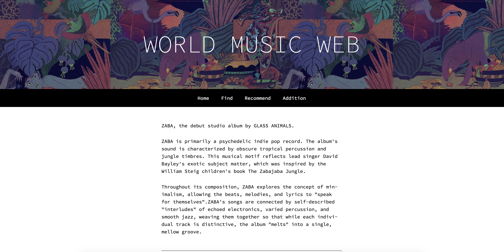

# Basic Express Site (2016 Edition)

A simple website in node js to accompany a blog post.

## deploy on aws
```
music.alanzyy.com

sudo nano app.js
>>change port 3000 to 80

sudo npm i
sudo npm run build
sudo nohup npm start & 

#to quit
ps -ef 
>>find pid
sudo kill -9 [pid]

```
## Setup

```
npm i
npm run build
npm start

# development mode (watches for source changes)
npm run watch
```

## Screenshot


